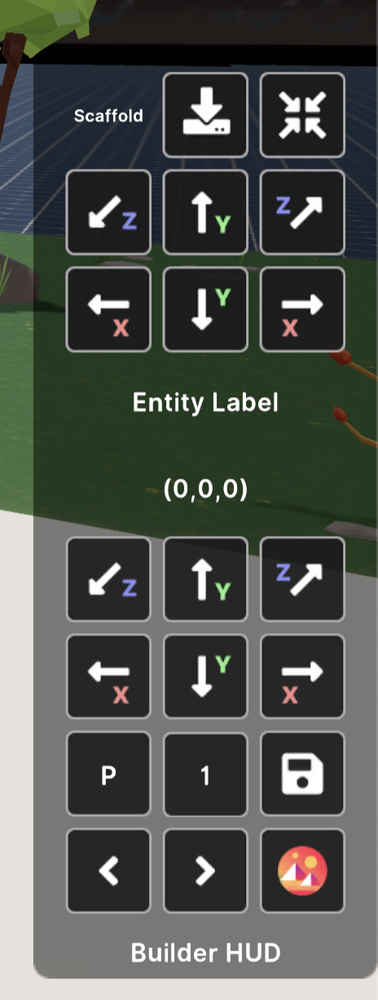
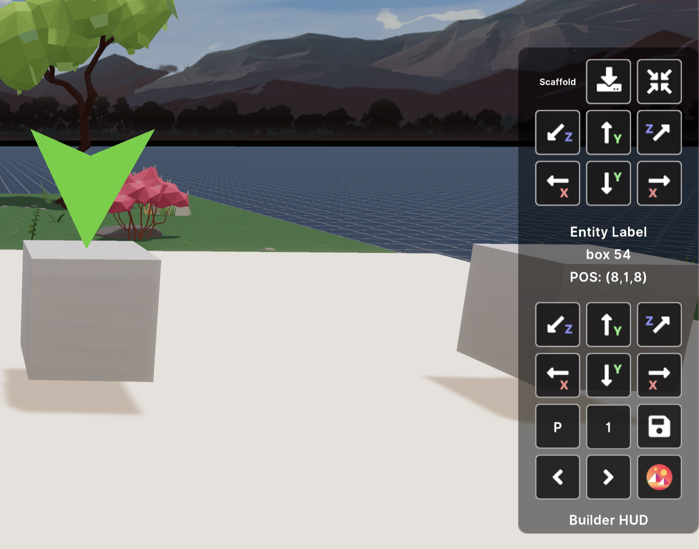

## BuilderHUD
Positioning entities in the sdk can be very difficult - always guessing the x,y,z of something. Well look no further! We have created a visual remote (based of Carl Farvel's original design) to help us position items in the sdk preview just like the Builder tool!
- Move entities visually within the sdk local previewer
- Save their PRS (position, rotation, scale) to the browser Console for you to easily copy / paste into your code
- Add the hud to as many entities as you want!




## Install

To use any of the helpers provided by this library:

1. Install this library as an npm package. Run this command in your scene's project folder:

   ```
   npm install dcl-builder-hud
   ```
   

### Attaching the hud to entities
- inside your scene code, make sure to import the hud code at the top of your code file
  code

```
import { hud } from "dcl-builder-hud"
```
  
- Make sure your entities have a "name" for them. This will make it easier to choose which entity you are modifying in the BuilderHUD tool. Naming an entity is easy; pass a string value "name" into the Entity(). Below, we are naming our entity "Box".
```
var box = new Entity("Box")
```

- After you give your entity the Transform() component AND add it to the engine, then we can add the entity variable to the hud!
```
var box = new Entity("Box")
box.addComponent(new BoxShape())
box.addComponent(new Transform({position: new Vector3(4,1,8), rotation: Quaternion.Euler(0,0,0), scale: new Vector3(1,1,1)}))
engine.addEntity(box)
hud.attachToEntity(box)
```


## Using the HUD

Once you've followed the steps to add the entities you want to deal with to the HUD, follow these steps:

1) Open a preview of the scene normally, with `dcl start`.

2) On the right-hand margin, click the Builder HUD icon to open the full UI.

	> Note: This icon might be obstructed by the FPS Panel. You can close this panel by opening the Debug Menu (on the right of the minimap), and toggling the eye icon next to "FPS Panel".

3) Click the left and right icons ( **<** **>**) to **select an entity** to handle. The name of the currently selected entity will be displayed in the UI, a green marker will also appear on top of the selected entity.

	

4) Toggle between **P**: Position, **R** Rotation and **S** Scale. Then toggle between the different levels of precision for each adjustment (1, 0.1, 0.01, etc).

5) Use the labeled direction arrows to move/rotate/scale the entity.

6) Once you're done, click the **save icon** to print out the transform values of each of the entities handled by the Builder HUD to console. To see these values, open up the browser console; In Google Chrome go to **View > Developer > Javascript console**.

7) Return to your scene's code, and paste the new transform values on an entity you wish to adjust, when creating its `Transform` component.

	For example, for the "Box" entity, you can paste its values in the following snippet:

	```ts
	var box = new Entity("Box")
	box.addComponent(new BoxShape())
	box.addComponent(new Transform( <PASTE HERE>)
	engine.addEntity(box)
	hud.attachToEntity(box)
	```

> Note: The Builder HUD is only available while in preview mode. Once your scene is published, players in your scene won't see this UI.


## The scaffold

Use the scaffold to reach high vantage points that might not be accessible to players in the scene. This might make it a lot easier to position certain entities.

The scaffold starts out on the ground in the scene's south-east corner. Hop on to the platform, then use the arrows in the upper section of the Builder Hud UI to move it around.

Once it starts moving in one direction, it will keep moving till you press another direction key. You can also press the **Reset icon** (on the top-left corner of the UI) to return the scaffold to its initial location on the ground.

